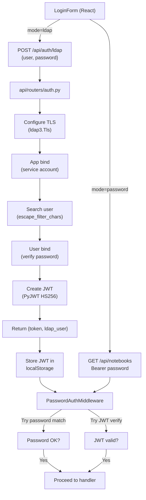

# LDAP Authentication Module for Open Notebook

## Architecture Overview

LDAP auth will coexist with the current password-based auth. When `ENABLE_LDAP=true`, the login page shows a mode switcher. LDAP users get a JWT token (instead of raw password); the middleware accepts both token types.




## Recommended Cursor Agents (from `.cursor/rules/`)

The table below maps each implementation area to the agent(s) best suited for review or guidance during that phase. Agents are referenced by their `.mdc` filename.

### Primary Agents

- **`security-engineer`** -- Core agent for the entire task. Covers LDAP bind/search security, `escape_filter_chars` usage, TLS configuration, JWT token design (HS256, secret management, expiration, `jti`), middleware authentication bypass prevention, and ensuring LDAP_APP_PASSWORD never leaks via API responses or logs. Should review **all** backend auth changes (steps 2--5).

- **`backend-architect`** -- FastAPI endpoint design, Pydantic model validation, async patterns (`asyncio.to_thread` for sync ldap3), middleware architecture, error handling hierarchy. Covers steps 1--5 (pyproject.toml, ldap_config.py, auth.py, routers/auth.py, main.py).

- **`frontend-developer`** -- React/Next.js login form, Zustand state management, hooks, Axios interceptors, TypeScript types. Covers steps 6--10 (types, API client, store, hook, LoginForm).

### Supporting Agents

- **`ui-designer`** -- Login form UX: mode switcher design (password vs LDAP), responsive layout with two input fields, visual hierarchy of the authentication toggle, accessibility of the form. Covers step 10 (LoginForm.tsx).

- **`code-reviewer`** -- Post-implementation review of all changes for correctness, security holes, maintainability, and edge cases. Especially useful for verifying: JWT secret fallback logic, middleware dual-auth path, LDAP connection error handling, and frontend 401 redirect behavior with JWT tokens.

- **`technical-writer`** -- Documentation quality for security.md: clear env var descriptions, working AD/OpenLDAP configuration examples, security caveats. Covers step 13.

- **`devops-automator`** -- Docker Compose LDAP env var configuration, Docker secrets pattern (`_FILE` suffix), network security considerations for LDAP traffic. Covers step 12.

- **`api-tester`** -- Test strategy for LDAP endpoints: valid/invalid credentials, LDAP disabled, TLS failures, admin config endpoints auth, JWT token expiration, middleware acceptance of both token types.

### Agent-to-Task Mapping

- Steps 1--2 (deps, ldap_config.py): `backend-architect`, `security-engineer`
- Step 3 (JWT middleware): `security-engineer` (primary), `backend-architect`
- Step 4 (LDAP endpoints): `security-engineer` (primary), `backend-architect`
- Step 5 (excluded paths): `backend-architect`
- Steps 6--7 (types, API client): `frontend-developer`
- Steps 8--9 (store, hook): `frontend-developer`
- Step 10 (LoginForm): `frontend-developer`, `ui-designer`
- Step 11 (i18n): `frontend-developer`
- Step 12 (docker-compose): `devops-automator`
- Step 13 (docs): `technical-writer`
- Post-implementation: `code-reviewer`, `api-tester`

---

## Backend Changes

### 1. Add dependencies to [pyproject.toml](pyproject.toml)

Add to `dependencies`:

- `ldap3>=2.9.1` -- LDAP client library
- `PyJWT>=2.8.0` -- JWT token creation/verification

### 2. Create [api/ldap_config.py](api/ldap_config.py) -- LDAP configuration

New file with a Pydantic `LdapSettings` model loaded from environment variables:

- `ENABLE_LDAP` (bool, default `false`)
- `LDAP_SERVER_LABEL` (str, default `"LDAP Server"`)
- `LDAP_SERVER_HOST` (str, default `"localhost"`)
- `LDAP_SERVER_PORT` (int, default `389`)
- `LDAP_ATTRIBUTE_FOR_MAIL` (str, default `"mail"`)
- `LDAP_ATTRIBUTE_FOR_USERNAME` (str, default `"uid"`)
- `LDAP_APP_DN` (str, default `""`)
- `LDAP_APP_PASSWORD` (str, default `""`)
- `LDAP_SEARCH_BASE` (str, default `""`)
- `LDAP_SEARCH_FILTERS` (str, default `""`)
- `LDAP_USE_TLS` (bool, default `true`)
- `LDAP_CA_CERT_FILE` (str, default `""`)
- `LDAP_VALIDATE_CERT` (bool, default `true`)
- `LDAP_CIPHERS` (str, default `"ALL"`)

Use `get_secret_from_env` for `LDAP_APP_PASSWORD` (Docker secrets support). Provide a `get_ldap_settings()` factory function that caches the loaded config.

### 3. Modify [api/auth.py](api/auth.py) -- JWT support in middleware

Add JWT token verification alongside existing password check:

- Import `jwt` (PyJWT) and add helper functions:
  - `get_jwt_secret()` -- reads `LDAP_JWT_SECRET` env var, falls back to `OPEN_NOTEBOOK_ENCRYPTION_KEY`
  - `create_ldap_jwt(username, email, cn)` -- creates HS256 JWT with `sub`, `email`, `name`, `type: "ldap"`, `exp` (24h default), `jti` (uuid)
  - `verify_ldap_jwt(token)` -- decodes and validates JWT, returns payload or raises
- Modify `PasswordAuthMiddleware.dispatch()`:
  - After password comparison fails, attempt `verify_ldap_jwt(credentials)`
  - If JWT valid, proceed; if both fail, return 401
- Modify `check_api_password()`:
  - Same fallback: password check -> JWT check

### 4. Modify [api/routers/auth.py](api/routers/auth.py) -- LDAP endpoints

Add three new endpoints to the existing `router`:

`**POST /ldap**` (public -- no auth required):

- Request body: `LdapLoginRequest(user: str, password: str)`
- Logic (all LDAP I/O via `asyncio.to_thread()`):
  1. Check `ENABLE_LDAP` is true (else 400)
  2. Configure TLS: `ldap3.Tls(validate=..., version=PROTOCOL_TLS, ca_certs_file=..., ciphers=...)`
  3. Create `ldap3.Server(host, port, use_ssl=LDAP_USE_TLS, tls=tls)`
  4. App bind: `Connection(server, APP_DN, APP_PASSWORD, authentication='SIMPLE'/'ANONYMOUS')`
  5. Search: `connection.search(search_base, filter=f"(&({attr}={escaped_user}){extra_filters})", attributes=[username_attr, mail_attr, 'cn'])`
  6. Extract `email`, `cn`, `user_dn` from entry
  7. User bind: new `Connection(server, user_dn, password)` to verify credentials
  8. Generate JWT via `create_ldap_jwt(username, email, cn)`
  9. Return `{"token": jwt, "user": username, "email": email, "name": cn}`
- Error handling: `AuthenticationError` / `ConfigurationError` -> 401/400/500

`**GET /ldap/config**` (admin-only -- Bearer must match `OPEN_NOTEBOOK_PASSWORD`):

- Returns current LDAP settings (mask `LDAP_APP_PASSWORD` with `"********"` if non-empty)

`**POST /ldap/config**` (admin-only):

- Accepts `LdapServerConfig` Pydantic model
- Updates the cached LDAP settings (runtime only -- env vars are the source of truth on restart)

Update `**GET /status**`:

- Add `ldap_enabled: bool` field to the response, read from `get_ldap_settings().enable_ldap`

### 5. Modify [api/main.py](api/main.py) -- excluded paths

Add `"/api/auth/ldap"` to the `excluded_paths` list in the `PasswordAuthMiddleware` constructor call (line ~130). The LDAP endpoint accepts `{user, password}` in body, not a Bearer token.

## Frontend Changes

### 6. Update [frontend/src/lib/types/auth.ts](frontend/src/lib/types/auth.ts) -- types

Add:

```typescript
export interface LdapLoginCredentials {
  user: string
  password: string
}

export type AuthMode = 'password' | 'ldap'

export interface AuthStatusResponse {
  auth_enabled: boolean
  ldap_enabled: boolean
  message: string
}

export interface LdapLoginResponse {
  token: string
  user: string
  email: string
  name: string
}
```

### 7. Create [frontend/src/lib/api/ldap.ts](frontend/src/lib/api/ldap.ts) -- LDAP API client

New file following the existing API module pattern (import `apiClient` from `./client`):

- `ldapSignIn(user: string, password: string)` -- `POST /auth/ldap` (use raw `fetch` with full apiUrl, since no Bearer token exists yet)
- `getLdapConfig(token: string)` -- `GET /auth/ldap/config` with Bearer header
- `updateLdapConfig(token: string, config)` -- `POST /auth/ldap/config` with Bearer header

### 8. Update [frontend/src/lib/stores/auth-store.ts](frontend/src/lib/stores/auth-store.ts) -- LDAP login

- Add `authMode: 'password' | 'ldap' | null` to state (derived from `checkAuthRequired`)
- Update `checkAuthRequired()`: read `ldap_enabled` from response, set `authMode` accordingly
- Add `ldapLogin(user: string, password: string)`: calls `ldapSignIn()`, stores returned JWT as `token`, sets `isAuthenticated`
- Update `checkAuth()`: if token looks like a JWT (contains dots), validate differently -- attempt `GET /api/notebooks` with Bearer JWT (middleware will verify)

### 9. Update [frontend/src/lib/hooks/use-auth.ts](frontend/src/lib/hooks/use-auth.ts) -- LDAP hook

- Add `handleLdapLogin(user: string, password: string)` mirroring `handleLogin` but calling `ldapLogin` from the store
- Export `handleLdapLogin`, `authMode` from hook

### 10. Update [frontend/src/components/auth/LoginForm.tsx](frontend/src/components/auth/LoginForm.tsx) -- UI

- Add state: `authMode: 'password' | 'ldap'`, `username: string`
- On mount, read `ldap_enabled` from auth status; if true, default to `'ldap'` mode
- Render mode switcher button: "Continue with LDAP" / "Continue with Password" (only when both modes available)
- LDAP mode: show username + password fields; password mode: show password field only (as before)
- Submit handler: dispatch to `handleLogin(password)` or `handleLdapLogin(username, password)` based on mode

### 11. Update i18n -- all 9 locale files

Files to modify (all in `frontend/src/lib/locales/*/index.ts`):

- `en-US`, `ru-RU`, `zh-CN`, `zh-TW`, `ja-JP`, `fr-FR`, `pt-BR`, `bn-IN`, `it-IT`

Add to the `auth` section of each locale:

- `ldapLoginTitle` -- e.g., "LDAP Sign In"
- `ldapLoginDesc` -- e.g., "Enter your LDAP credentials"
- `usernamePlaceholder` -- e.g., "Username"
- `continueWithLdap` -- e.g., "Continue with LDAP"
- `continueWithPassword` -- e.g., "Continue with Password"
- `authenticating` -- e.g., "Authenticating..."
- `ldapAuthFailed` -- e.g., "LDAP authentication failed"

Use English for `en-US`; provide translated strings for other locales.

## Configuration / Docker

### 12. Update [docker-compose.yml](docker-compose.yml)

Add commented-out LDAP env vars to the `open_notebook` service `environment` section:

```yaml
# LDAP Authentication (optional)
# - ENABLE_LDAP=false
# - LDAP_SERVER_HOST=ldap.example.com
# - LDAP_SERVER_PORT=389
# - LDAP_USE_TLS=true
# ...etc
```

### 13. Update [docs/5-CONFIGURATION/security.md](docs/5-CONFIGURATION/security.md)

Add a new "LDAP Authentication" section after the existing password auth content:

- All LDAP env vars with descriptions
- Example configurations for Active Directory and OpenLDAP
- Security notes (TLS, escaping, JWT secret)
- Coexistence with password auth explanation

